# Entity Relationship Diagram

The diagram shows ownership and foreign-key direction. Generic audit targets (`target_type` plus
`target_id`) and history sources (`source_type` plus `source_id`) are intentionally polymorphic and
therefore are not foreign keys.

```mermaid
erDiagram
  users ||--o{ user_roles : has
  roles ||--o{ user_roles : grants
  users ||--o{ auth_accounts : owns
  users ||--o{ refresh_tokens : owns
  refresh_tokens o|--o| refresh_tokens : replaces

  users o|--o{ places : verifies
  places ||--o{ place_categories : classified_as
  categories ||--o{ place_categories : classifies
  places ||--o{ menus : offers
  places ||--o{ place_facilities : provides
  facilities ||--o{ place_facilities : describes
  places ||--o{ operating_hours : schedules
  places ||--o{ operating_hour_exceptions : overrides
  places ||--o{ place_photos : has

  users o|--o{ contributions : submits
  places o|--o{ contributions : targeted_by
  contributions o|--o{ contributions : revises
  contributions ||--|| contribution_payloads : stores
  contributions ||--o{ contribution_photos : includes
  contributions ||--o{ moderation_reviews : reviewed_by
  users ||--o{ moderation_reviews : performs
  places o|--o{ moderation_reviews : duplicate_of

  users ||--o{ place_confirmations : confirms
  places ||--o{ place_confirmations : receives
  users ||--o{ place_reports : reports
  users o|--o{ place_reports : reviews
  places ||--o{ place_reports : receives
  place_reports ||--o{ report_evidence : includes

  integration_sources ||--o{ google_form_submissions : receives
  contributions o|--o{ google_form_submissions : produces
  contributions o|--o{ geocoding_results : geocoded_for
  places o|--o{ geocoding_results : geocoded_for

  users o|--o{ audit_logs : acts
  users o|--o{ place_change_history : changes
  places ||--o{ place_change_history : records
```

`idempotency_keys` has no domain foreign key by design; its uniqueness boundary is
`(scope, idempotency_key)`.
